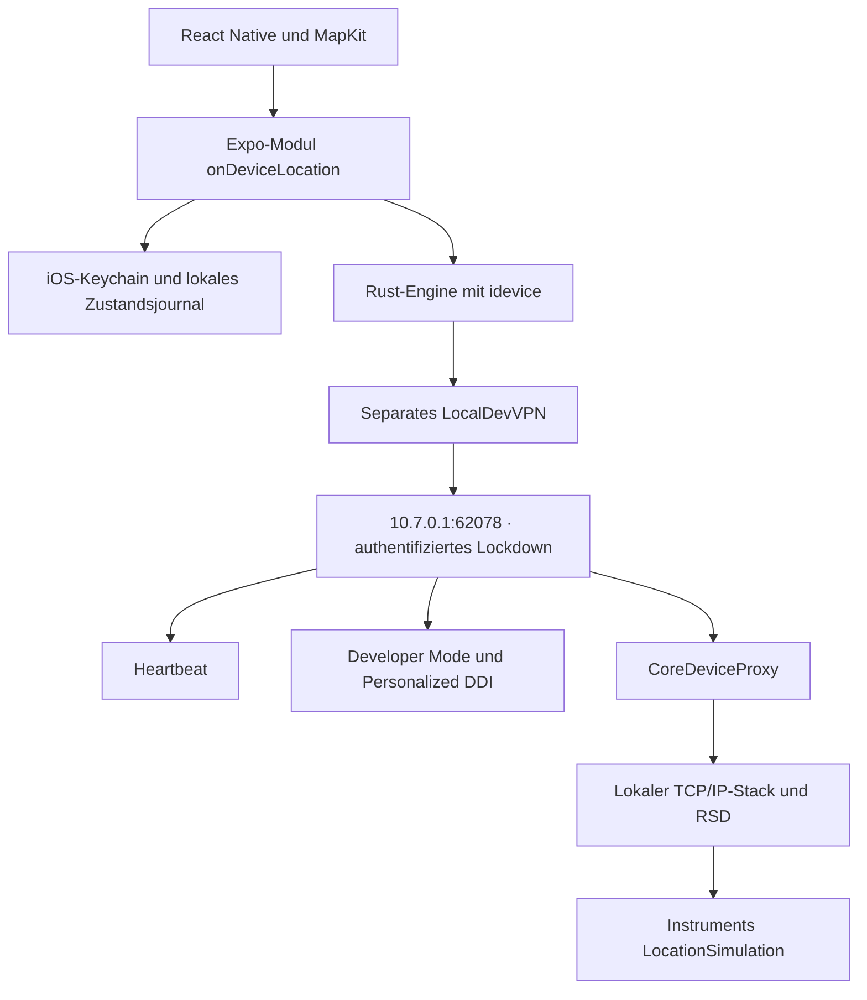

# Native Standort-Engine

Stand: 26. August 2026

Diese Anleitung beschreibt ausschließlich die weiterhin vorhandene native Swift-/Rust-Engine. Für den neu integrierten, in Expo Go verwendbaren Modus „VPS über VPN“ gilt [gatewaySetup.md](gatewaySetup.md). Dessen Tests unter iOS 26.6 beziehen sich auf den VPS-Dienst, nicht auf eine Erweiterung der unten beschriebenen nativen iOS-Unterstützung.

## Was implementiert ist

Die Expo-App enthält einen nativen Swift-Adapter und einen Rust-Protokollkern für den CoreDevice-/DVT-Pfad auf iOS 17.4–18.x. Die Implementierung enthält reale Netzwerkoperationen und wartet bei Setzen und Zurücksetzen auf eine DVT-Antwort. Sie verwendet keine erfundene `CLLocationManager`-Setter-Methode.

**Der native iOS-Build und die Funktion auf einem iPhone sind noch nicht verifiziert.** In dieser Windows-Umgebung wurden Rust-Tests, TypeScript-Tests, Expo-Autolinking und der iOS-JavaScript-Bundle-Export geprüft. Eine bestehende IPA enthält diese Änderungen noch nicht.

Die App benötigt initiales Computer-Pairing und die separate App LocalDevVPN. Sie enthält keine eigene Network Extension. iOS 17.0–17.3, iOS 26 und neuere Versionen sind in dieser Implementierung gesperrt. Ein bloßes Installieren einer IPA gewährt keinen Zugriff auf Developer-Dienste.

## Architektur



Die Engine hängt von [idevice](https://github.com/jkcoxson/idevice/tree/c65dfbf17b888c5795f17ea3e3dad60e6737252c) am festen Commit `c65dfbf17b888c5795f17ea3e3dad60e6737252c` ab. Der konkrete DVT-Dienst heißt `com.apple.instruments.server.services.LocationSimulation`. Die Befehle sind `simulateLocationWithLatitude:longitude:` und `stopLocationSimulation`. Es handelt sich um authentifizierte Developer-Kommandos, nicht um Kernel-Schreibzugriffe. Der CoreDeviceProxy-Pfad unterscheidet sich vom älteren Zugang vor iOS 17.4. [Protokollübersicht von pymobiledevice3](https://github.com/doronz88/pymobiledevice3/blob/master/docs/guides/ios17-tunnels.md)

## 1. Neue IPA bauen

### Auf einem Mac

Benötigt werden Xcode 16.4 mit iOS-SDK, Node.js 22, npm, CocoaPods und Rustup. Im Projekt:

```sh
cd expoApp
npm ci
rustup toolchain install 1.94.0 --profile minimal --component clippy --component rustfmt
npm test
npm run typecheck
npm run buildNativeEngine
npx expo prebuild --platform ios --clean
open ios/expoApp.xcworkspace
```

In Xcode das App-Target wählen, die eigene Signing-Team-Zuordnung einstellen und auf dem angeschlossenen iPhone bauen. Für Betrieb ohne Metro-Server unter **Product → Scheme → Edit Scheme → Run → Build Configuration** die Einstellung **Release** wählen. Ein gewöhnlicher Debug-Build kann weiterhin einen Computer für das JavaScript-Bundle benötigen. Beim sauberen Prebuild wird das generierte Verzeichnis `expoApp/ios` ersetzt; eigene Änderungen deshalb in Config-Plugins halten.

`buildNativeEngine` führt die Rust-Tests aus, baut ARM64 für Geräte sowie ARM64 und x86_64 für den Simulator und erstellt `expoApp/modules/onDeviceLocation/ios/frameworks/locationEngine.xcframework`. Erst danach darf CocoaPods die native App integrieren. Der Simulator kann die Oberfläche zeigen, aber nicht die DVT-Engine dieses Geräts verwenden.

### Über GitHub Actions

Der bestehende Workflow `.github/workflows/buildExpoIpa.yml` wurde erweitert: macOS 15, Xcode 16.4, Rust-Build, Tests, XCFramework-Erzeugung, Expo-Prebuild und App-Build. Nach dem Übertragen dieser Änderungen ins Repository lässt sich **Build Expo iOS IPA** manuell ausführen. In diesem Arbeitsgang wurde weder gepusht noch ein Remote-Build gestartet.

Ein erfolgreicher Lauf stellt das Artefakt `expoApp-ipa` mit `expoApp.ipa` und SHA-256-Prüfsumme bereit. Die IPA ist nur ad hoc signiert und muss vor der Installation mit dem eigenen Sideloading-Verfahren korrekt signiert werden. Die Pipeline enthält keine Apple-Zugangsdaten. Eine alte IPA oder ein alter erfolgreicher Workflow-Lauf ist kein Nachweis für diesen Quellstand.

**Expo Go reicht nicht.** Das native Modul muss in einem eigenen Build enthalten sein. Auch ein JavaScript-Update allein kann das Rust-/Swift-Modul nicht nachinstallieren.

## 2. iPhone einmal vorbereiten

1. Die eigene signierte App auf einem echten iPhone mit iOS 17.4–18.x installieren.
2. Entwicklermodus in den iOS-Einstellungen aktivieren und den erforderlichen Neustart bestätigen. Falls die Einstellung noch fehlt, zuerst das Gerät für Entwicklung koppeln.
3. Das entsperrte iPhone per USB an den Computer anschließen und die Vertrauensabfrage bestätigen.
4. [idevice_pair aus dem offiziellen Projekt](https://github.com/jkcoxson/idevice_pair) öffnen. Das eigene Gerät auswählen, **Lockdown** wählen, den Datensatz laden oder erstellen, validieren und mit **Save to file** speichern. Kein Remote-Pairing-/RPPairing-Dokument verwenden.
5. Die drahtlose Developer-Verbindung über USB aktivieren. Ein kompatibles Developer Disk Image kann ebenfalls am Computer gemountet werden. idevice_pair bietet diese Gerätefunktionen an. [Projektanleitung](https://github.com/jkcoxson/idevice_pair#usage)
6. Die eigene Lockdown-Datei sicher auf das iPhone übertragen und in der App über **⚙ → Pairing importieren** auswählen.

Die Pairing-Datei enthält private Schlüssel. Sie wird ausschließlich nativ gelesen und in `kSecAttrAccessibleAfterFirstUnlockThisDeviceOnly` gespeichert, nicht über die JavaScript-Schnittstelle transportiert und nicht in einen App-Server hochgeladen. Originaldatei und Sicherung trotzdem wie Zugangsdaten behandeln. Nicht ins Repository aufnehmen.

## 3. Lokales VPN und Developer-Image

LocalDevVPN separat installieren und dessen VPN aktivieren. Danach in der Standort-App den Zugriff auf das lokale Netzwerk erlauben. Für die erste Verbindung das iPhone entsperrt lassen und mit WLAN verbinden. Auch StikDebug dokumentiert Loopback-VPN, gültiges Pairing und WLAN bei Heartbeat-Problemen als Voraussetzungen. Dies ist ein Vergleich der Architektur, kein Funktionstest dieser App. [StikDebug-Anleitung](https://github.com/StikDebug/StikDebug#requirements)

Wenn bereits ein kompatibles Personalized Developer Disk Image gemountet ist, ist kein Dateiimport nötig. Andernfalls in **⚙ → Drei Image-Dateien importieren** gemeinsam auswählen:

- `Image.dmg`
- `Image.dmg.trustcache`
- `BuildManifest.plist`

Die drei Dateien müssen zum selben kompatiblen Developer Disk Image gehören. Ein äußeres Download-DMG mit weiteren Unterverzeichnissen ist nicht das eigentliche Image. Die App verteilt keine Apple-Images mit. Nur reguläre Dateien werden akzeptiert; das Image ist auf 2 GB begrenzt, die beiden Begleitdateien jeweils auf 16 MB.

Der Import kopiert die Dateien in ein geschütztes, vom Backup ausgeschlossenes App-Verzeichnis. Die Engine berechnet den Image-Hash, fragt einen vorhandenen Personalisierungsnachweis ab und nutzt andernfalls Apples TSS-Dienst. Deshalb kann die erste Personalisierung Internet benötigen. Das Image wird in 64-KB-Blöcken übertragen. Nach einem Geräteneustart kann ein erneutes Mounten nötig sein.

## 4. Standort setzen und zurücksetzen

1. In **⚙** auf **DVT-Verbindung vorbereiten** drücken. Bei einem Image-Upload kann das bis zu vier Minuten dauern. Fehler nennen den fehlenden Schritt.
2. Erst bei **DVT bereit** zur Karte zurückkehren.
3. Einen Ort auswählen oder den roten Marker verschieben und **Standort setzen** drücken.
4. Die App wartet auf eine erfolgreiche Antwort. Erst dann wird die bestätigte Position blau markiert. Der echte MapKit-Benutzerpunkt bleibt eine von iOS gelieferte Position.
5. Zum Beenden **Standort zurücksetzen** drücken und die Bestätigung abwarten. Danach kann es dauern, bis iOS wieder eine aktuelle reale Position liefert; Satellitenempfang wird dadurch nicht erzwungen.

Die Swift-Schnittstelle exportiert `setLocation(latitude, longitude)`, `resetLocation()`, `getState()`, `prepare()`, `importPairing()`, `importDeveloperImage()`, `forgetPairing()` und `requestBackgroundPermission()` unter dem Expo-Modulnamen `onDeviceLocation`.

## Zustände und Fehlerbehandlung

| Zustand | Bedeutung |
| --- | --- |
| `disconnected` | Keine laufende Developer-Sitzung; kein in dieser Sitzung bestätigter aktiver Befehl. |
| `ready` | Authentifizierter Tunnel und DVT-Kanal sind geöffnet. |
| `active` | Setzen wurde bestätigt und die Engine hat noch keinen Sitzungsabbruch festgestellt. |
| `unknown` | Die Simulation könnte noch wirken. Wieder verbinden und explizit zurücksetzen. |

Ein lokales Journal wird vor der Übertragung eines Setzbefehls geschrieben. Nach einem Prozessende stellt die App daraus **unbestätigt** wieder her, niemals automatisch **aktiv**. Tunnel-/Heartbeat-Abbruch schließt die Sitzung; die UI gleicht den Zustand beim Zurückkehren und im Vordergrund alle fünf Sekunden ab. Es werden keine Koordinaten nach einem Abbruch heimlich erneut gesetzt. Eine neue Pairing-Datei kann auch bei unbestätigtem Zustand importiert werden; das Löschen der einzigen Pairing-Identität bleibt bis zum bestätigten Reset gesperrt.

| Meldung | Nächster Schritt |
| --- | --- |
| Native Engine fehlt | Aktuelle IPA mit gebautem XCFramework installieren; Expo Go verlassen. |
| Nicht erreichbar / Heartbeat / Zeitüberschreitung | LocalDevVPN und WLAN prüfen, iPhone entsperren, lokalen Netzwerkzugriff erlauben. |
| Pairing abgelehnt / anderes Gerät | Neuen Lockdown-Datensatz für dieses iPhone erzeugen, validieren und importieren. |
| Entwicklermodus deaktiviert | In den Einstellungen aktivieren und neu starten. |
| Developer Disk Image fehlt | Kompatibles Image am Computer mounten oder die drei Dateien importieren. |
| Personalisierung fehlgeschlagen | Internetzugriff und Image-Kompatibilität prüfen. |
| DVT-Befehl nicht bestätigt | Keine erfolgreiche Änderung annehmen; Verbindung reparieren und zurücksetzen. |

## Grenzen

Die Umsetzung verspricht weder 0 ms Systemlatenz noch dauerhaftes Weiterlaufen im Hintergrund oder Funktion bei reinem Mobilfunk. Die App kann mit erteilter Berechtigung Core Location im Hintergrund beobachten; iOS entscheidet weiterhin über die Ausführung. Es werden keine Audio-Schleifen, Selbst-Debugging-Tricks oder privaten Entitlements zum Umgehen der Suspendierung eingesetzt.

Eine erfolgreiche DVT-Antwort bestätigt den Developer-Befehl, nicht das Ergebnis in jeder Fremd-App. Apps können simulierte Daten erkennen; Apple stellt dazu `isSimulatedBySoftware` bereit. Verhalten von „Wo ist?“, Snap Map, Instagram, Google Maps und Tinder muss getrennt geprüft werden. [Apple-Dokumentation](https://developer.apple.com/documentation/corelocation/cllocationsourceinformation)

Favoriten liegen ausschließlich auf dem Gerät. Geocoding und MapKit-Kartendaten können Apple-Dienste benötigen. Daher ist die gesamte App nicht pauschal offlinefähig.

## Verifikation und Freigabe

Unter Windows erfolgreich geprüft:

- 20 TypeScript-Service-Tests mit nativen Test-Doubles.
- 12 Rust-Tests, einschließlich echter DVT-Kodierung über einen simulierten Byte-Transport, fragmentierter Antworten, Image-Framing, Fehlerantworten und Zustandsübergängen.
- Rust Clippy ohne Warnungen und TypeScript ohne Typfehler.
- Expo-Konfiguration, Erkennung des lokalen Moduls und erzeugter Swift-Modules-Provider.
- iOS-JavaScript-/Hermes-Bundle-Export.

Diese Tests ersetzen weder Apple-SDK-Kompilierung noch Geräteprüfung. Vor einer Freigabe auf mindestens einem iPhone jeder vorgesehenen iOS-Version testen: Import, erstmaliges Mounten, Setzen, frische Core-Location-Beobachtung, Reset, VPN-Abbruch, Prozessende, Sperrbildschirm, Geräteneustart, Pairing-Wechsel und jede gewünschte Fremd-App. Es wurde hier keine neue installierbare IPA erzeugt.

`npm audit` meldet im beibehaltenen SDK-54-Stack 16 Befunde, darunter 9 hohe und 7 moderate. Es erfolgte kein erzwungenes SDK-Upgrade. Die Implementierung ist deshalb und wegen der offenen Apple-/Gerätetests noch nicht als produktionsreif freigegeben.

## Dateien und Abhängigkeiten

| Bereich | Datei |
| --- | --- |
| Protokollkern | `expoApp/nativeEngine/src/locationEngine.rs` |
| Native Expo-API | `expoApp/modules/onDeviceLocation/ios/onDeviceLocationModule.swift` |
| Keychain, Imports, Journal | `expoApp/modules/onDeviceLocation/ios/engineStorage.swift` |
| Core-Location-Beobachtung | `expoApp/modules/onDeviceLocation/ios/systemLocationObserver.swift` |
| JS-Zustandsabgleich | `expoApp/sources/services/locationSimulationService.ts` |
| Einrichtung | `expoApp/sources/ui/engineSetupSheet.tsx` |
| iOS-Framework-Build | `expoApp/scripts/buildNativeEngine.cjs` |
| Entitlements-/Deployment-Konfiguration | `expoApp/plugins/withLocationEngine.cjs` |

Der Protokollkern nutzt idevice direkt; es wurde kein StikDebug-App-Code übernommen. `Cargo.lock` und der idevice-Commit fixieren die Abhängigkeiten. Native Lizenzhinweise werden aus den Cargo-Paketen erzeugt und als Ressource mitgeliefert. Bei Paketen ohne mitgelieferte Lizenzdatei enthält der Generator den im Cargo-Manifest deklarierten SPDX-Lizenztext; die Original-Metadaten bleiben zugeordnet. Die kanonischen Texte stammen aus [SPDX license-list-data v3.27.0](https://github.com/spdx/license-list-data/tree/v3.27.0/text).

Eigener Anwendungscode enthält keine Kommentare oder Docstrings. Framework-vorgegebene Namen, Dateiformate und generierte Metadaten behalten ihre erforderliche Schreibweise; fremde Lizenztexte werden unverändert erhalten.
